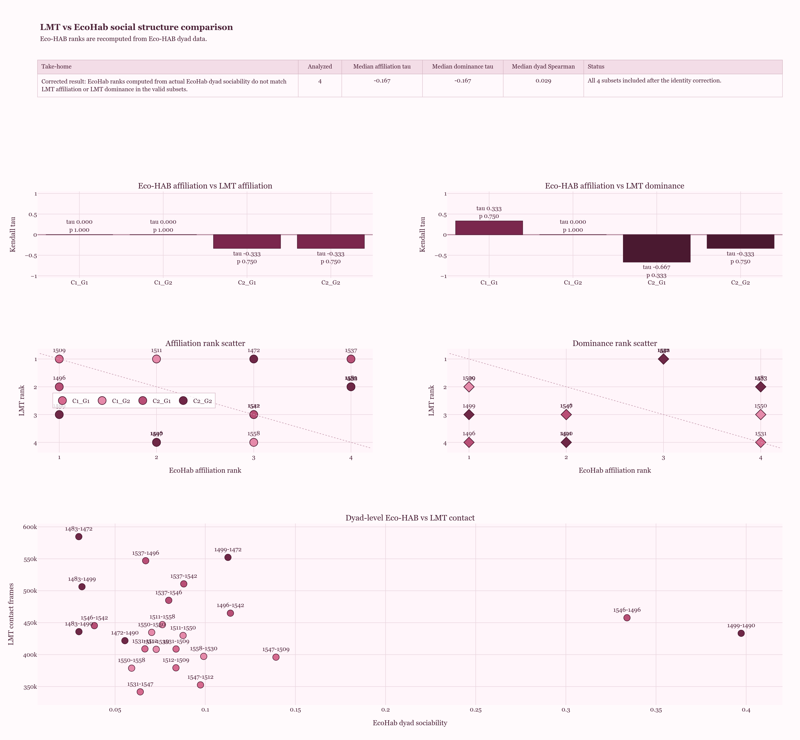

Live-Mouse-Tracker (LMT) pipeline + T-maze stats

This repo contains two complementary pieces:

LMT.py — computes Social, Spatial, and Dominance indices from a single LMT *.sqlite recording, and exports harmonized CSVs + publication-ready figures.

stats.py — correlates those LMT indices with T-maze performance (learning slope and mean accuracy) using Spearman’s ρ with permutation p-values, plus per-group meta-analysis and forest plots.

Both scripts share a unified visual theme for consistent figures.

Showcase

The repo also includes a compact EcoHab vs LMT dashboard snapshot built from the current comparison outputs:



That figure is meant as a quick visual summary of how affiliation-style signals from EcoHab line up with LMT affiliation and dominance summaries across subsets.
1) LMT pipeline (LMT.py)

  What it computes

  - Social index (0–1): weighted combo of fast approaches/min, fast escapes/min (balanced), and % time in contact.

  - Spatial index (0–1): locomotion, arena use, and exploration strategy features.

  - Dominance index (0–1): pairwise wins from approach/escape events → exposure-normalized → ranked via Plackett–Luce/Bradley–Terry, then scaled to 0–1.

  Inputs:
  
  - One LMT Recording.sqlite.
  
  outputs (to the recording’s folder unless out_dir given):
  
  - social_metrics.csv, spatial_metrics.csv
  
  - social_index.csv, spatial_index.csv, dominance_index.csv
  
  - social_spatial_dom_index.csv
  
  - PNGs: bars, components, heatmap, combined indices

  How to start:
  ```
  # (optional) environment
  conda create -n lmt_social python=3.11 -y
  conda activate lmt_social
  pip install -r requirements.txt
  
  # run
  python LMT.py path/to/Recording.sqlite out/Recording --species mouse
  # or
  python LMT.py path/to/Recording.sqlite out/Recording --species rat
  ```
  Useful flags
  
  - Species presets: --species {mouse,rat}
  
  - Scaling: --social-scale {minmax,robust,zscore} (default robust)
  
  - Weights override: --weights-json weights.json
  
  - Dominance: --dominance {davids,plackettluce} (default PL), --dom-transform {None,log1p,rate}, --dom-cap <float>
  
  - Geometry/speeds: --move, --burst, --contact-mm, --iso-mm, --fast-thr, --margin-mm, --corner-mm
  
  - Utility: --debug, --no-heatmap

2) T-maze correlates (stats.py)

  What it does
  
  - Loads LMT outputs (indices) from one or many groups under --base.
  
  - Loads tmaze_summary.csv (rfid, day, accuracy) and builds learning slope (accuracy~day) + mean accuracy.
  
  - Computes pooled Spearman ρ with permutation p and saves CSVs + heatmaps + scatter grid.
  
  - Runs per-group exact Spearman + meta (Fisher-z, Stouffer p) and saves a tidy table + forest plots.
  
  Layout:
  ```
  repo/
  ├─ LMT.py
  ├─ stats.py
  ├─ data/
  │  └─ tmaze_summary.csv        # rfid, day, accuracy
  ├─ outputs/
  │  └─ <GROUP_A>/
  │      ├─ social_spatial_index.csv  OR  social_spatial_dom_index.csv
  │      └─ dominance_index.csv
  │  └─ <GROUP_B>/ ...
  └─ requirements.txt
  ```
  Install & run
  ```
  pip install -r requirements-stats.txt
  
  # All groups under --base
  python stats.py --base outputs --tmaze data/tmaze_summary.csv --out outputs/stats_all
  
  # One specific group
  python stats.py --base outputs --tmaze data/tmaze_summary.csv --group C1G1 --out outputs/stats_C1G1
  ```
  Outputs (in --out)
  
  - CSV: corr_rho.csv, corr_p_perm.csv, corr_q_perm_bh.csv, meta_spearman_meta.csv
  
  - PNG: corr_heatmap.png, corr_heatmap_poster.png, scatter_grid.png,
  meta_forest_<Y>_vs_<X>.png (one per pair)

Requirements are in requirements.txt
